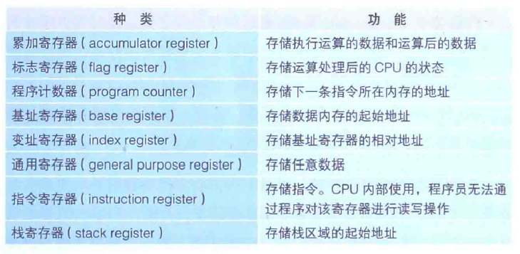
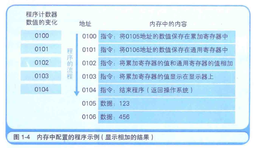
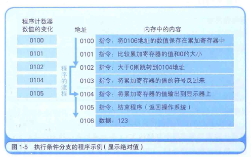
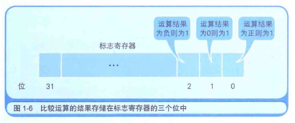
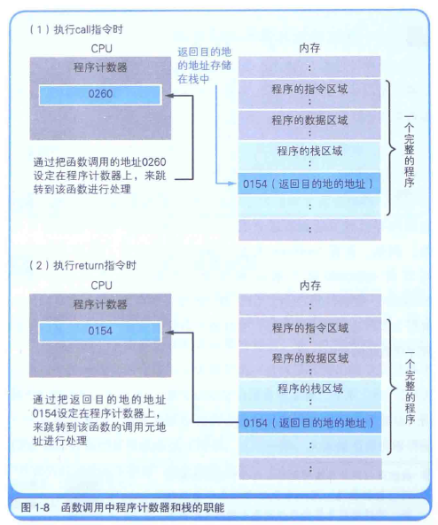
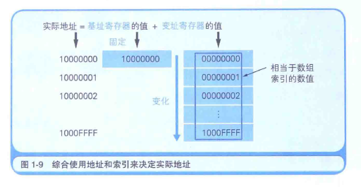

# 对程序员来说CPU是什么

[TOC]


#### 1.1 CPU的内部结构解析

------

CPU所负责的就是解释和运行最终转换成机器语言的程序内容.


CPU和内存是由许多晶体管组成的电子部件, 通常称为IC (Integrated Circuit, 集成电路).

CPU的内部由**寄存器**, **控制器**, **运算器**和**时钟**四个部分构成, 各部分之间的电流信号相互连通.


**寄存器**可用来暂存指令, 数据等处理对象.可以将其看作是内存的一种.根据种类不同, 一个CPU内部会有20~100个寄存器.

**控制器**负责把内存上的指令, 数据等读入寄存器, 并根据指令的执行结果来控制整个计算机.

**运算器**负责从内存读入寄存器的数据.

**时钟**负责发出CPU开始计时的时钟信号[^①]. 不过, 也有些计算机的时钟位于CPU的外部.

> 时间脉冲信号 (英文: Clock signal). 此信号在同步电路中, 扮演计时器的角色, 并组成电路的电子组件. 只有当同步信号到达时, 相关的触发器才按输入信号改变输出状态, 因此使得相关的电子组件得以同步运作.

[^①]: 时钟信号英文叫作 clock puzzle. GHz 表示时钟信号的频率 (1GHz = 10 亿次/秒). 也就是说, 时钟信号的频率越高, CPU的运行速度越快.

通常所说的内存指的是计算机的主存储器 (main memory), 简称主存.

> 主存位于计算机机体内部, 是负责存储程序, 数据等的装置. 主存通常使用 DRAM (Dynamic Random Access Memory, 动态随机存取存储器)芯片. DRAM可以对任何地址进行数据的读写操作, 但需要保持稳定的电源供给并时常刷新 (确保是最新数据) . 关机后内容将自动清除.

主存通过控制芯片等与CPU相连, 主要负责存储指令和数据.

主存由可读写的元素组成, 每个字节 (1字节 = 8位)都带有一个编号.

CPU可以通过该地址读取主存中的指令和数据, 当然也可以写入数据.但有一点需要注意, 主存中存储的指令和数据会随着计算机的关机而自动清除.

内存的特点是访问速率快. 内存是电脑中的主要配件, 它是相对于外存而言的.

我们平常使用的程序, 如Windows操作系统, 打字软件, 游戏软件等一般都是安装在硬盘等外存上的, 但仅此是不能使用其功能的, 必须把它们调入内存中运行, 才能真正使用其功能.就好比在一个书房里, 存放书籍的书架和书柜相当于电脑的外存, 而我们的办公桌就是内存.

**程序运行机制**

程序启动后, 根据时钟信号,  控制器会从内存中读取指令和数据.通过对这些指令加以解释和运行, 运算器就会对数据进行运算, 控制器根据该运算结果来控制计算机. 

> 其实所谓的控制就是指数据运算以外的处理 (主要是数据输入输出的时机控制). 比如内存和磁盘等媒介的输入输出, 键盘和鼠标的输入, 显示器和打印机的输出等, 这些都是控制的内容.

#### 1.2 CPU是寄存器的集合体

CPU的四个构成部分中, 程序员只需要了解寄存器即可, 其余三个都不用太过关注.

为什么需要了解寄存器呢? 这是因为程序是把寄存器作为对象来描述的.

汇编语言编写的程序示例:

```assembly
mov eax, dword ptr [ebp-8]   ... 把数值从内存复制到eax
add eax, dword ptr [ebp-0Ch] ... exa的数值和内存的数值相加
mov dword ptr [ebp-4], eax   ... 把exa的数值(上一步的相加结果) 存储在内存中
```

eax和ebp表示的都是寄存器, 是CPU内部的寄存器的名称, 内存的存储场所通过地址编号来区分, 而寄存器的种类则通过名字来区分. eax是累加寄存器, ebp是基址寄存器.

这是用汇编语言 (assembly) 编写的程序的一部分. 汇编语言采用助记符 (memonic) 来编写程序, 每一个原本是电气信号的机器语言指令都会有一个与其相应的助记符, 助记符通常为指令功能的英语单词的简写.例如, mov 和 add 分别是数据的存储 (move) 和相加 (addition) 的简写.

通常我们将汇编语言编写的程序转化成机器语言的过程成为汇编; 反之, 机器语言程序转换成汇编语言程序的过程则称为反汇编.

> 把汇编语言转化成机器语言的程序称为汇编器 (assembler). 有时汇编语言也称为汇编.
>
> 机器语言是指CPU能直接解释和执行的语言.
>
> 高级编程语言是指能够使用类似于人类语言 (主要是英语) 的语法来记述的编程语言的总称.

根据功能的不同, 我们可以将寄存器大致划分为八类, 寄存器中存储的内容既可以是指令也可以是数据. 其中, 数据分为 "用于计算的数值" 和 "表示内存地址的数值" 两种. 数据种类不同, 存储该数值的寄存器也不同. 

CPU中每个寄存器的功能都是不同的. 用于运算的数值放在累加寄存器中存储, 表示内存地址的数值则放在基址寄存器和变址寄存器中存储.



#### 1.3 决定程序流程的程序计数器



地址 0100是程序运行的开始位置. Windows等操作系统把程序从硬盘复制到内存后, 会将程序计数器 (CPU寄存器的一种) 设定为0100, 然后程序便开始运行. CPU每执行一个指令, 程序计数器的值就会自动加1. 例如, CPU执行0100地址的指令后, 程序计数器的值就变成了 0101 (当执行的指令占据多个内存地址时, 增加与指令长度相应的数值). 然后, CPU的控制器就会参照程序计数器的数值, 从内存中读取命令并执行. 也就是说, 程序计数器决定程序的流程.

#### 1.4 条件分支和循环控制

程序的流程分为顺序执行, 条件分支和循环三种. 

**顺序执行**是指按照地址内容的顺序执行指令.

**条件分支**是指根据条件执行任意地址的指令.

**循环**是指重复执行同一地址的指令.

顺序执行的情况比较简单, 每执行一个指令, 程序计数器的值就自动加1.但若程序中存在条件分支和循环, 机器语言的指令就可以将程序计数器的值设定为任意地址 (不是+1). 这样一来, 程序便可以返回到上一个地址来重复执行同一个指令, 或者跳转到任意地址.



程序运行的开始位置是0100地址, 随着程序计数器数值的增加, 当到达0102地址时, 如果累加寄存器的值是正数, 则执行跳转指令 (jump指令) 跳转到0104地址. 此时, 由于累加寄存器的值是123, 为正数, 因此0103地址的指令被跳过, 程序的流程直接跳到了0104地址.也就是说 "跳转到0104地址" 这个指令间接执行了 "将程序计数器设定成0104地址" 这个操作.

条件分支和循环中使用的**跳转指令**, 会参照当前执行的计算结果来判断是否跳转. 无论当前累加寄存器的运算结果是负数, 零 还是正数, 标志寄存器都会将其保存 (也负责存放溢出 和 奇偶校验 的结果).

> 溢出 (overflow) 是指运算的结果超出了寄存器的长度范围.
>
> 奇偶校验 (parity check) 是指检查运算结果的值是偶数还是奇数.

CPU在进行运算时, 标志寄存器的数值会根据运算结果自动设定. 条件分支在跳转指令前会进行比较运算. 至于是否执行跳转指令, 则由CPU在参考标志寄存器的数值后进行判断. 结果为正, 零, 负三种状态由标志寄存器的三个位表示.



上图是32位CPU(寄存器的长度是32位, 4个字节)的标志寄存器的示例.

标志寄存器的第一个字节位, 第二个字节位和第三个字节位的值为1时, 表示运算结果分别为正数, 零 和 负数.

CPU执行比较的机制很有意思, 例如, 假设要比较累加寄存器中存储的XXX值和通用寄存器中存储的YYY值, 执行比较的指令后, CPU的运算装置就会在内部 (暗中) 进行 XXX-YYY的减法运算. 而无论减法的结果是正数, 零 还是负数, 都会保存到标志寄存器中. 结果为正表示XXX比YYY大, 零表示XXX和YYY相等, 负表示XXX比YYY小.

程序中的比较指令就是在CPU内部做减法运算.

#### 1.5 函数的调用机制

函数调用处理也是通过把程序计数器设定成函数的存储地址来实现的. 不过, 这和条件分支, 循环的机制有所不同, 因为单纯的跳转指令无法实现函数的调用.函数的调用需要在完成函数内部的处理后, 处理流程再返回到函数调用点 (函数调用指令的下一个地址). 因此, 如果只是跳转到函数的入口地址, 处理流程就不知道应该返回到哪里了.

机器语言的call指令和return指令能够解决这个问题.函数调用使用的是call指令, 而不是跳转 (jump)指令.


上图是给变量a和b分别代入123 和 456后, 将其赋值给参数 (parameter) 来调用MyFunc行数的C语言程序.

图中的地址是将C语言翻译成机器语言后运行时的地址.由于1行C语言程序在编译后通常会变成多行的机器语言, 所以图中的地址是离散的.

在将函数的入口地址设定到程序计数器之前, call指令会把调用函数后要执行的指令地址存储在名为栈的主存内.函数处理完毕后, 再通过函数的出口来执行return命令. return命令的功能是把保存在栈中的地址设定到程序计数器中. MyFunc函数被调用之前, 0154地址保存在栈中. MyFunc函数的处理完毕后, 栈中的0154地址就会被读取出来, 然后再被设定到程序计数器中.



在编译高级程序语言的程序后, 函数调用的处理会转换成call指令, 函数结束的处理则会转换成return指令. 这样依赖, 程序的运行就变得非常流畅.

#### 1.6 通过地址和索引实现数组

通过基址寄存器和变址寄存器, 我们可以对主内存上特定的内存区域进行划分, 从而实现类似于数组的操作.

首先, 我们用十六进制数将计算机内存上00000000~FFFFFFFF的地址划分出来.那么凡是该范围的内存区域,只要有一个32位的寄存器, 即可查看全部的内存地址.但如果想要像数组那样分割特定的内存区域以达到连续查看的目地,使用两个寄存器会更方便些.



例如, 查看10000000地址~1000FFFF地址时, 如上图所示, 可以将10000000存入基址寄存器, 并使变址寄存器的值在00000000~0000FFFF变化. CPU则会把基址寄存器 + 变址寄存器的值解释为实际查看的内存地址. 变址寄存器的值就相当于高级编程语言程序中数组的索引功能.

> 二进制数的位数较多, 不易理解时, 通常使用十六进制数来代替二进制数. 这是一种数到16就进位的计数方式. 我们用A~F来分别表示10~15, 那么, 二进制数的4位 (0000 ~ FFFF) 就可以用十六进制数的1位 (0~F) 来表示. 32位的二进制数, 就可以用8位的十六进制数来表示.

#### 1.7 CPU的处理其实很简单

可能有些读者不知道机器语言和汇编语言的指令到底有多少种, 因而对CPU的运行没什么概念. 为了消除大家心中的这个疑团, 接下来我们就来看一下机器语言到底有哪些种类.

| 类型             | 功能                                                         |
| :--------------- | :----------------------------------------------------------- |
| 数据传送指令     | 寄存器和内存, 内存和内存, 寄存器和外围设备之间的数据读写操作<br /><br />mov、push、pop、lea |
| 运算指令         | 用累加寄存器执行算术运算、逻辑运算、比较运算和移位运算<br />add、sub、mul、div、adc、sbb、cmp |
| 跳转指令         | 实现条件分支、循环、强制跳转等                               |
| call/return 指令 | 函数的调用/返回调用的地址                                    |

[关于汇编语言寄存器和指令操作的整理]: http://www.cnblogs.com/technology/archive/2010/05/16/1736782.html
[汇编语言--汇编指令系统总结]: https://www.jianshu.com/p/4a7b716a2d1b
[x86汇编语言指令集]: http://www.cnblogs.com/loopever/archive/2013/03/24/2979512.html

