# 数据是用二进制数表示的

[TOC]


- 32位是几个字节？

  4

  因为8位 = 1字节, 所以 32位就是 32 ÷ 8 = 4 字节

- 二进制数01011100转换成十进制数是多少？

  将二进制数的各数位的值和位权相乘后再相加, 即可转换成为十进制数.

  92
  $$
  1*2^6+1*2^4+1*2^3+1*2^2=64+16+8+4=92
  $$

- 二进制数00001111左移两位后， 会变成原数的几倍？

  4倍

  二进制数左移1位后会变成原来的值的2倍, 左移两位后, 就是2倍的2倍, 即4倍.

- 补码形式表示的8位二进制数11111111， 用十进制数表示的话是多少？

  -1

- 补码形式表示的8位二进制数10101010，用16位的二进制数表示的话是多少？

  1111111110101010

- 反转部分图形模式时，使用的是什么逻辑运算？

  XOR 运算只反转与1相对应的位. NOT运算是反转所有的位.


##### 1.1 用二进制数表示计算机信息的原因

想必大家都知道计算机内部是由IC (集成电路) 这种电子部件构成的. CPU和内存也是IC的一种.IC有几种不同的形状, 有的像一条黑色蜈蚣, 在其两侧有数个乃至数百个引脚; 有的像插花用的针盘, 引脚在IC内部并排排列着. IC的所有引脚, 只有直流电压0V和5V两个状态.也就是说, IC的一个引脚, 只能表示两个状态.

IC的这个特性, 决定了计算机的信息数据只能用二进制数来处理. 由于1位 (一个引脚) 只能表示两个状态, 所以二进制的计数方式就变成了0, 1 , 10, 11, 100 ...这种形式. 虽然二进制数并不是专门为IC而设计的, 但是和IC的特性非常吻合. 计算机处理信息的最小单位----位, 就相当于二进制中的一位. 位的英文bit是二进制数位 (binary digit) 的缩写.

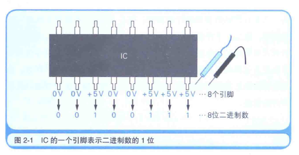

二进制数的位数一般是8位, 16位, 32位 ......也就是8的倍数, 这是因为计算机所处理的信息的基本单位是8位二进制数. 8位二进制数被称为一个**字节**. 字节是最基本的信息计量单位. 位 是最小单位, 字节是基本单位. 内存和磁盘都是用字节单位来存储和读写数据, 使用位单位则无法读写数据, 因此, 字节是信息的基本单位.

> 字节 (bit) 是由 bite (咬) 一词而衍生出来的词语, 8位 (8 bit) 二进制数, 就类似于 "咬下的一口", 因此被视为信息的基本单位.

用字节单位处理数据时, 如果数字小于存储数据的字节数, 那么高位上就用0填补. 例如, 100111这个6位二进制数, 用8位 ( = 1 字节) 表示时为00100111, 用16位 ( = 2 字节) 表示时为 0000000000100111.

32位微处理器, 具有32个引脚以用于信息的输入和输出. 也就是说, 一次可以处理32位 ( = 4 字节) 的二进制数信息.

程序中, 即使是用十进制数和文字等记述信息, 在编译后也会转换成二进制数的值, 所以, 程序运行时计算机内部处理的也是用二进制数表示的信息.

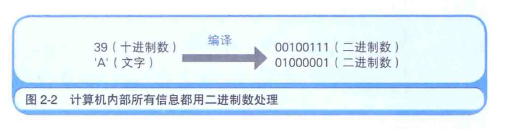

对于用二进制数表示的信息, 计算机是不会区分它是数字, 文字, 还是某种图片的模式等, 而是根据编写程序的各位对计算机发出的指示来进行信息的处理 (计算) .

##### 1.2 移位运算和乘除运算的关系

**移位运算**指的是将二进制数值的各数位进行左右移位 (shift = 移位) 的运算. 移位有左移 (向高位方向) 和 右移 (向低位方向) 两种. 在一次运算中, 可以进行多个数位的移位操作.

将变量a的值左移两位的C语言程序:

```c
a = 39;
b = a << 2;
```

该示例是 把变量a中保存的十进制数值39左移两位后再将运算结果存储到变量b中.

<< 这个运算符表示左移, >>表示右移.

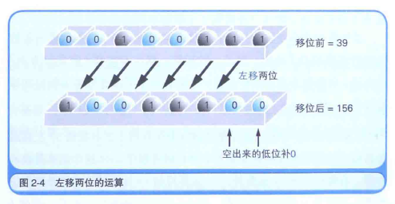

移位运算也可以通过数位移动来代替乘法运算和除法运算. 例如, 将 00100111左移两位的结果是10011100, 左移两位后数值编程了原来的4倍. 用十进制数表示的话, 数值从39 (00100111) 变成了 156 (10011100), 正好是4倍 (39*4 = 156).

其实, 反复思考几遍后就会发现确实如此. 十进制数左移会变成原来的10 倍,  100倍, 1000倍 ......同样, 二进制数左移后就变成原来的2倍, 4倍, 8倍 ...... 反之, 二进制数右移后则会变成原来的1/2, 1/4, 1/8...... 这样一来, 就能理解为什么移位运算能代替乘法运算和除法运算了.

> 因为位移比乘除速度快, 对效率要求高, 而且满足2的幂次方的乘除运算, 可以采用位移的方式计算.

##### 1.3 便于计算机处理的 "补数"

左移空出来的低位补0, 右移空出来的高位则有 0 和 1 两种形式. 要想区分什么时候补0什么时候补1, 只需要掌握二进制数是如何表示负数的方法即可.

二进制数中表示负数值时, 一般会把最高位作为符号来使用, 因此我们把这个最高位成为符号位. 符号位是0时表示整数, 符号位是1时表示负数.

那么,-1用8位二进制数来表示的话是什么样的呢? 可能有很多人会认为 "1" 的二进制数是 00000001, 因此 - 1 就是 10000001, 但这个答案是错的, 正确答案是 11111111.

计算机在做减法运算时, 实际上内部是在做加法运算. 用加法运算来实现减法运算, 是不是很新奇呢? 为此, 在表示负数时就需要使用 "二进制的补数". 补数就是用正数来表示负数, 很不可思议吧.

为了获得补数, 我们需要将二进制数的各数位的数值全部取反, 然后再将结果加1. 例如, 用8位二进制数表示 -1 时, 只需求得1, 也就是 00000001的补数即可. 具体来说, 就是将各数位的0取反成1, 1取反成0, 然后再将取反的结果加1, 最后就转化成了11111111.

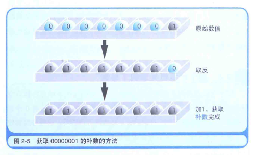

补数的思考方式, 虽然直观上不易理解, 但逻辑上却非常严谨.

例如,  1 - 1 , 也就是 1 + ( - 1 )这一运算, 我们都知道答案是0. 首先让我们将 - 1 表示成 10000001 (错误的表示方法) 来运算, 看看结果如何.

00000001 + 10000001 = 10000010, 很明显结果并不是0, 如果结果是0, 那么所有的数位都应该是0才对.

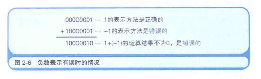

接下来, 让我们把-1表示成11111111(正确的表示方法) 来进行运算. 00000001 + 11111111 确实是0 ( = 00000000). 这个运算出现了最高位溢出的情况. 不过, 对于溢出的位, 计算机会直接忽略掉. 在8位的范围内进行计算时, 100000000这个9位的二进制数就会被认为是00000000这一8位二进制数.

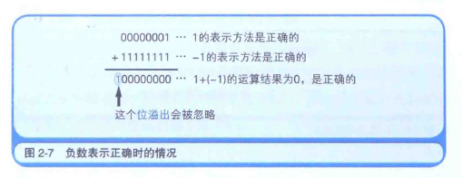

补数求解的变换方法就是 "取反 + 1".为什么使用补数后就能正确的表示负数了呢?

希望大家牢记"将二进制数的值取反后加1的结果, 和原来的值相加, 结果为0" 这一法则, 总之, 要想使结果为0, 就必须通过补数来实现.

当然, 结果不为0的运算同样可以通过使用补数来得到正确的结果. 不过, 有一点需要注意, 当运算结果为负数时, 结算结果也是以补数的形式来表示的. 比如, 3 - 5 这个运算, 用8位二进制数表示3时是 00000011, 而5 = 00000101 的补数为 "取反+1", 也就是11111011, 因此 3 - 5 其实就是 00000011 + 11111011 的运算 = 11111110, 最高为是1 , 表示这个结果是个负数, 那么11111110表示的负数是多少呢?  我们可以利用负负得正这个性质来知道它的值. 11111110的补数, 同样取反+1, 得到 00000001+1 = 00000010, 也就是十进制的2, 所以 11111110表示的就是 - 2 .

所以, 3 - 5 的结果是 -2.

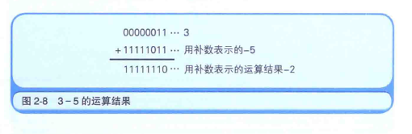

编程语言包含的整数类型中, 有的可以处理负数, 有的则不能处理负数. 例如, C语言的数据类型中, 既有不能处理负数的unsigned short 类型, 也有能处理负数的short类型. 这两种类型, 都是2字节 (= 16位) 的变量, 都能表示2的16次幂 = 65535种值, 这一点是相同的. 不过值的范围有所不同, short类型值是 -32768 ~ 32767, unsigned short类型是 0~65535. short类型和unsigned类型的另一个不同点在于, short类型是将最高位为1的数值看作补数, 而unsigned short类型这是 32768以上的值.

仔细思考一下补数的机制, 大家就会明白想 -32768~32767这样负数比整数多一个的原因了. 最高位是0的整数, 有 0 ~ 32767共 32768个, 这其中也包含0. 最高位是1的负数, 有-1 ~ 32768共32768个, 这其中不包含0. 也就是说, 0包含在正整数范围内. 所以 负数要比整数多一个. 虽然0不是正数, 但考虑到符号位, 就将其划到了正数中.

##### 1.4 逻辑右移和算数右移的区别

右移有移位后在最高位补0和补1两种情况, 当二进制数的值表示图形模式而非数值时, 移位后需要在最高位补0.类似于霓虹灯往右滚动的效果, 这就称为逻辑右移.

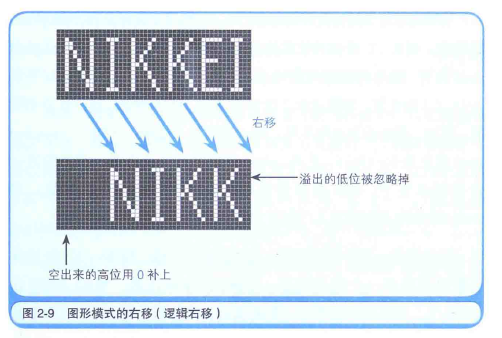

将二进制数作为带符号的数值进行运算时, 移位后要在最高位填充移位前符号的值 (0或1) , 这就称为算术右移.

如果数值是用补数表示的负数值, 那么右移后在空出来的最高位补1, 就可以正确地实现1/2, 1/4, 1/8等的数值元算. 如果是正数, 是需要在最高位补0即可.

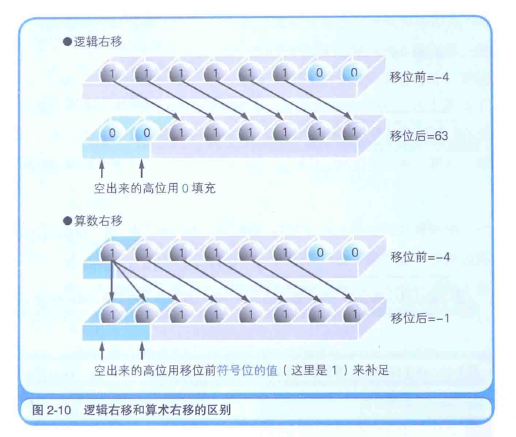

上图, 将 -4 (=11111100) 右移两位, 逻辑右移的情况下, 结果会变成00111111, 也就是十进制数63, 显然不是-4的1/4.

算术右移的情况下, 结果就变成了11111111, 也就是补数表示的-1, 即-4的1/4.

只有在右移时才需要区分逻辑移位和算术移位. 左移时, 无论是图形模式 (逻辑左移) 还是相乘运算 (算术左移), 都是需要在空出来的低位补0即可.

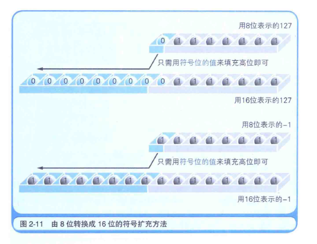

符号扩充: 以8位二进制数为例, 符号扩充就是在保持值不变的前提下, 将其转换成16位和32位的二进制数. 将01111111这个正的8位二进制数转换成16位二进制数时, 很容易就能得出0000000001111111这个结果, 但是像11111111这样用补数来表示的数值, 该如何处理呢? 实际上处理方法也很简单, 将其表示成1111111111111111就可以了, 也就是说, 不管是正数还是用补数表示的负数, 都只需要用符号位的值 (0或1) 填充高位即可. 这就是符号扩充的方法.

##### 1.5 掌握逻辑运算的窍门

计算机能处理的运算, 大体可以分为**算术运算**和**逻辑运算**. 

**算术运算**是指加减乘除四则运算. 

**逻辑运算**是指对二进制数各数字的0和1分别进行处理的运算, 包括**逻辑非** (NOT运算), **逻辑与** (AND运算), **逻辑或**(OR运算)和**逻辑异或**(XOR 或者EOR)运算四种.

> XOR是英语 exclusive or 的缩写. 有时也将XOR称为EOR.

**逻辑非**指的是0变成1, 1变成0的取反操作.

**逻辑与**指的是 "两个都是1"时, 运算结果为1. 其他情况下运算结果都为0.

**逻辑或**指的是"至少有一个是1", 运算结果为1, 其他情况下的运算结果都是0.

**逻辑异或**指的是排斥相同数值的运算, "两个数值不同", 也就是说, 当"其中一方是1, 另一方是0"时运算结果是1, 其他情况下结果都是0.

不管是几位的二进制数, 在进行逻辑运算时, 都是对相对应的各数位分别进行运算.

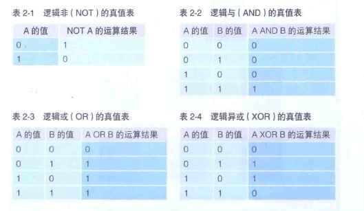