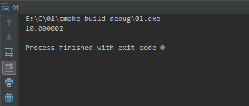
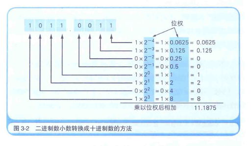
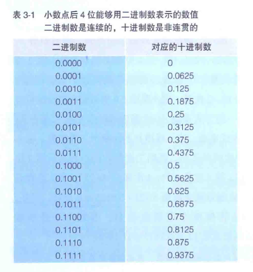
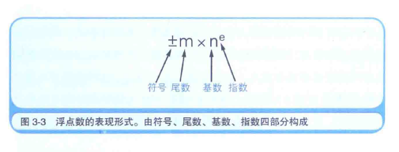
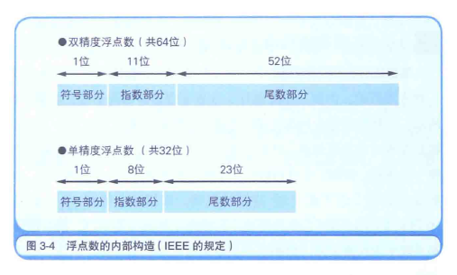
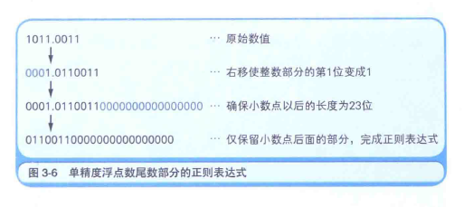

# 计算机进行小数运算时出错的原因

[TOC]

1. 二进制数0.1, 用十进制数表示的话是多少?

   ​

2. 用小数点后有3位的二进制数, 能表示十进制数0.625吗?

3. 将小数分为符号, 尾数, 基数,指数4部分进行表现的形式称为什么?

4. 二进制数的基数是多少?

5. 通过把0作为数值范围的中间值, 从而在不使用符号位的情况下来表示负数的表示方法称为什么?

6. 10101100.01010011这个二进制数, 用十六进制数表示的话是多少?


##### 1.1 将0.1累加100次也得不到10

```c
#include <stdio.h>

int main() {
    float sum = 0;

    for (int i = 0; i < 100; i++) {
        sum += 0.1;
    }

    printf("%f \n", sum);
    return 0;
}
```

程序执行结果:



程序没错, 计算机也没有发生故障, 当然, C语言也没有什么问题. 可为什么会出现这样的结果呢?

计算机内部是如何处理小数的呢?

##### 1.2 用二进制数表示小数

把1011.0011这个有小数点的二进制数转换成十进制数, 小数点前面部分只需要将各数位数值和位权相乘, 然后再将相乘的结果相加即可实现. 小数点后面的部分也是将各数位的数值和位权相乘的结果相加即可.



二进制数小数点前面部分的位权, 第1位是2的0次幂, 第二位是2的1次幂...... 以此类推.

小数点后面部分的位权, 第1位是2的-1次幂, 第二位是2的-2次幂,...... 以此类推.

0次幂前面的位的位权按照1次幂, 2次幂......的方式递增.0次幂以后的位权按照-1次幂, -2次幂......的方式递减.

这一规律并不仅限于二进制数, 在十进制数和十六进制数中也同样适用.

##### 1.3 计算机运算出错的原因

了解了将二进制小数转换成十进制数的方法后, 计算机运算出错的原因也就容易理解了.

计算机之所以出现运算错误, 是因为"有一些十进制数的小数无法转换成二进制数".我们来看一下不能正确表示的原因.



小数点后4位用二进制数表示时的数值范围为0.0000~0.1111. 因此, 这里只能表示0.0625, 0.125, 0.25, 0.5这四个二进制数小数点后面的位权组合而成(相加总和)的小数.

十进制数0的下一位是0.0625, 因此, 这中间的小数就无法用小数点后4位数的二进制数来表示. 同样, 0.0625的下一位数一下子变成了0.125.

这时, 如果增加二进制数小数点后面的位数, 与其对应的十进制数的个数也会增加, 但不管增加多少位, 2的-x次幂怎么相加都无法得到0.1这个结果.

实际上, 十进制数0.1转换成二进制后, 会变成0.00011001100...(1100循环)这样的循环小数. 这和无法用十进制数来表示1/3是一样的道理. 1/3就是0.3333..., 同样是循环小数.

因为无法表示正确的数值, 最后都变成了近似值. 计算机这个功能有限的机器设备, 是无法处理无限循环小数的. 因此, 在遇到循环小数时, 计算机就会根据变量数据类型所对应的长度将数值从中间截断或者四舍五入.

我们知道将0.3333...这样的循环小数从中间截断就会编程0.333333, 这时它的3倍是无法得到1的 (结果是0.999999). 计算机运算出错的原因也是同样的道理.

>  十进制小数转换成二进制小数采用"乘2取整，顺序排列"法。具体做法是：用2乘十进制小数，可以得到积，将积的整数部分取出，再用2乘余下的小数 部分，又得到一个积，再将积的整数部分取出，如此进行，直到积中的小数部分为零，或者达到所要求的精度为止。 
> ​    然后把取出的整数部分按顺序排列起来，先取的整数作为二进制小数的高位有效位，后取的整数作为低位有效位。
>
> 所以 , 十进制数0.1转换成二进制的结算过程:
>
> | 表达式  | 小数 | 整数 |
> | :-----: | :--: | :--: |
> | 0.1 * 2 | 0.2  |  0   |
> | 0.2 * 2 | 0.4  |  0   |
> | 0.4 * 2 | 0.8  |  0   |
> | 0.8 * 2 | 1.6  |  1   |
> | 0.6 * 2 | 1.2  |  1   |
> | 0.2 * 2 | 0.4  |  0   |
> |   ...   | ...  | ...  |
>
> 所以 十进制数0.1转换成二进制后, 会变成0.00011001100...(1100循环)这样的循环小数

##### 1.4 什么是浮点数

像1011.0011这样带小数点的表现形式, 完全是纸面上的二进制数表现形式, 在计算机内部是无法使用的. 那么实际上计算机是以什么样的表现形式来处理小数的呢?

很多编程语言中都提供了两种表示小数的数据类型, 分别是单精度浮点数和双精度浮点数. 双精度浮点数类型用64位, 单精度浮点数用32位来表示全体小数. 浮点数究竟采用怎样的方式来表示小数呢?

浮点数是指用符号, 尾数, 基数, 指数这四部分来表示小数.



因为计算机内部使用的是二进制数, 所以基数自然是2. 因此, 实际的数据中往往不考虑基数, 只用符号, 尾数, 指数这三部分即可表示浮点数. 也就是说, 64位 (双精度浮点数) 和 32位 (单精度浮点数) 的数据, 会被分为三部分来使用.



符号部分是指使用一个数据位来表示数值的符号. 该数据位是1时表示负数, 为0时表示正数或者0.

数值的大小用尾数部分和指数部分来表示. 小数就是用 尾数部分 x 2的指数部分次幂 这样的形式来表示的.

尾数部分用的是 "将小数点前面的值固定为1的正则表达式".

指数部分用的是 "EXCESS系统表现".

> 按照特定的规则来表示数据的形式即为正则表达式, 初小数之外, 字符串以及数据库等, 也都有各自的正则表达式.
>
> 正数是指使用包含表示符号的最高位在内的全体来表示一个数值. 而浮点数是由符号部分, 尾数部分和指数部分这三部分独立的数据组合而成的.

#####  1.5 正则表达式和EXCESS系统

尾数部分使用正则表达式, 可以将表现形式多样的浮点数统一为一种表现形式. 

例如, 十进制数0.75就有很多种表现形式.


虽然 他们表示的是同一个数值, 但因为表现方法太多, 计算机处理时会比较麻烦, 因此, 为了方便计算机处理, 需要制定一个统一的规则. 这个规则就是正则表达式.

十进制的规则是: 小数点前面是0, 小数点后面第1位不能是0. 根据这个规则, 0.75就是 0.75 x 10的0次幂.

二进制的规则是: 将小数点前面的值固定为1. 具体来讲, 就是将二进制数表示的小数左移或右移 ( 这里是逻辑移位, 因为符号位是独立的) 数次后, 整数部分的第1位变为1, 第2位之后都变为0 ( 这样是为了削除第2位以上的数位).  而且, 第1位的1在实际的数据中不保存. 由于第1位必须是1, 因此省略该部分后就节省了一个数据位, 从而也就可以表示更多的数据范围(虽不算太多).



