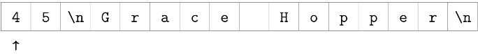
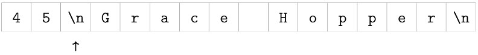

# Think Java

- **[Input and Output](#input-and-output)**
- **[For and Foreach](#for-and-foreach)**


------

### Input and Output

- [The Scanner Class](#the-scanner-class)
- [Formatting Output](#formatting-output)


##### The Scanner Class

The System class also provides the special value System.in, which is an InputStream
that provides methods for reading input from the keyboard. These methods are not
easy to use; fortunately, Java provides other classes that make it easier to handle common
input tasks.
For example, Scanner is a class that provides methods for inputting words, numbers,
and other data. Scanner is provided by java.util, which is a package that contains
classes so useful they are called “utility classes”. Before you can use Scanner, you have
to import it like this:

```java

import java.util.Scanner;

public class Hello {
    public static void main(String[] args){
        String line;
        Scanner in = new Scanner(System.in);
        System.out.print("Type something: ");
        line = in.nextLine();
        System.out.println("You said: " + line);
        System.out.print("Type something else: ");
        line = in.nextLine();
        System.out.println("You also said: " + line);
    }
}

```

> **The Scanner Bug**
>
> Now that you’ve had some experience with Scanner, there is an unexpected behavior
> we want to warn you about. The following code fragment asks users for their name
> and age:
>
> ```Java
> int age;
> String name;
> Scanner in = new Scanner(System.in);
> System.out.print("What is your name? ");
> name = in.nextLine();
> System.out.print("What is your age? ");
> age = in.nextInt();
> System.out.printf("Hello %s, age %d\n", name, age);
> ```
>
> The output might look something like this:
>
> ​	**Hello Grace Hopper, age 45**
>
> When you read a String followed by an int, everything works just fine. But when
> you read an int followed by a String, something strange happens.
>
> ```java
> int age;
> String name;
> Scanner in = new Scanner(System.in);
> System.out.print("What is your age? ");
> age = in.nextInt();
> System.out.print("What is your name? ");
> name = in.nextLine();
> System.out.printf("Hello %s, age %d\n", name, age);
> ```
>
> Try running this example code. It doesn’t let you input your name, and it immediately
> displays the output:
> ​	**What is your name? Hello , age 45**
>
> To understand what is happening, you have to understand that the Scanner doesn’t
> see input as multiple lines, like we do. Instead, it gets a “stream of characters” as
> shown in below:
>
> 
>
> The arrow indicates the next character to be read by Scanner. When you call
> nextInt, it reads characters until it gets to a non-digit. Figure 3-4 shows the state of
> the stream after nextInt is invoked.
>
> 
>
> At this point, nextInt returns 45. The program then displays the prompt "What is
> your name? " and calls nextLine, which reads characters until it gets to a newline.
> But since the next character is already a newline, nextLine returns the empty string
> "".
>
> To solve this problem, you need an extra nextLine after nextInt.
>
> ```java
> int age;
> String name;
> Scanner in = new Scanner(System.in);
> System.out.print("What is your age? ");
> age = in.nextInt();
> //**************
> in.nextLine();
> //***************
> System.out.print("What is your name? ");
> name = in.nextLine();
> System.out.printf("Hello %s, age %d\n", name, age);
> ```
>
> This technique is common when reading int or double values that appear on their
> own line. First you read the number, and then you read the rest of the line, which is
> just a newline character.

##### Formatting Output

| type character       | input          | string result                            |
| :------------------- | :------------- | :--------------------------------------- |
| `%d`                 | signed `int`   | signed decimal integer                   |
| `%u`                 | unsigned `int` | unsigned decimal integer                 |
| `%o`                 | unsigned `int` | unsigned octal integer                   |
| `%x`, `%X`           | unsigned `int` | unsigned hexadecimal integer, lowercase or uppercase |
| `%z[`n`]`, `%Z[`n`]` | unsigned `int` | unsigned integer base n, with n coded in decimal; include square brackets |
| `%f`                 | `float`        | real number, standard notation           |
| `%e`, `%E`           | `float`        | real number, scientific notation (lowercase or uppercase exponent marker) |
| `%g`, `%G`           | `float`        | same format as `%f` or `%e`, depending on the value. Scientific notation is used only if the exponent is greater than the precision or less than -4. |
| `%s`                 | `String`       | string                                   |
| `%c`                 | `char`         | character                                |
| `%p`                 | `Object`       | object identity hash code (i.e., pointer value), in unsigned hexadecimal |
|                      |                |                                          |
| `%\n`                | *(none)*       | platform-independent line separator (see §3) |
| `%n`                 | *(null)*       | counts characters (see §4)               |

| %d   | decimal integer                          | 12345    |
| ---- | ---------------------------------------- | -------- |
| %08d | padded with zeros, at least 8 digits wide | 00012345 |
| %f   | floating-point                           | 6.789000 |
| %.2f | rounded to 2 decimal places              | 6.79     |

aaa

------

**For and Foreach**

Since traversing arrays is so common, Java provides an alternative syntax that makes
the code more compact. For example, consider a for loop that displays the elements
of an array on separate lines:

```java
        for (int i = 0; i < src.length; i++) {
            System.out.println(src[i]);
        }
```

We could rewrite the loop like this:

```java
        for (double value : src){
            System.out.println(value);
        }
```

This statement is called an enhanced for loop. You can read it as, “for each value in
values”. It’s conventional to use plural nouns for array variables and singular nouns
for element variables.

Enhanced for loops often make the code more readable, especially for accumulating
values. But they are not helpful when you need to refer to the index, as in search
operations.

##### 