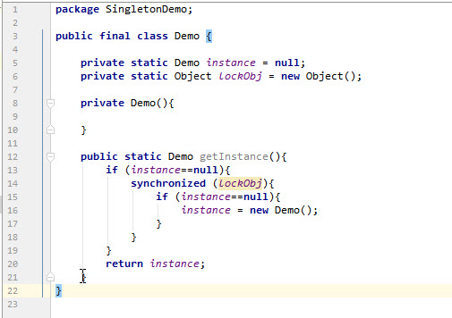

# 线程安全的单例模式

- **[饥饿模式](#饥饿模式)**
- **[懒汉模式](#懒汉模式)**
- **[双重检查锁](#双重检查锁)**
- **[Initialization on Demand Holder](#initialization-on-demand-holder)**


------

### 饥饿模式

代码示例:

```java
public final class Demo {

    private static Demo instance = new Demo();

    private Demo(){

    }

    public static Demo getInstance(){
        return instance;
    }
}
```

这种写法就是所谓的饥饿模式, 对象在没有使用之前已经初始化了. 这种可能带来潜在的性能问题: 如果这个对象很大, 没有使用这个对象之前, 就已经把它加载到了内存中. 

------

### 懒汉模式

代码示例:

```java
public final class Demo {

    private static Demo instance = null;

    private Demo(){

    }

    public static Demo getInstance(){
        if (instance==null){
            instance= new Demo();
        }
        return instance;
    }
}
```

这种写法就是所谓的懒汉模式(延迟加载 Lazy-load Singleton), 它使用延迟加载来保证对象在没有使用之前, 是不会进行初始化的. 但是这种写法, 在多线程下并不安全. 当多个线程同时执行到判断instance是否为null时, 就会同时进行初始化.

------

### 双重检查锁

double-checked lock

代码示例:

```java
public final class Demo {

    private static Demo instance = null;
    private static Object lockObj = new Object();
    
    private Demo(){

    }

    public static Demo getInstance(){
        if (instance==null){
            synchronized (lockObj){
                if (instance==null){
                    instance = new Demo();
                }
            }
        }
        return instance;
    }
}
```

把同步的粒度降底, 只有初始化对象的时候才进行同步. 在加载完成后, 其他线程就可以跳过判断锁的代价.

------

### Initialization on Demand Holder

double checked lock 写法还是有问题的:



假设线程A执行到了第13行, 它判断对象为空, 于是线程A执行到16行去初始化这个对象, 但是初始化是需要消耗时间的. 但是这个对象的地址其实已经存在了. 此时线程B也执行到第13行, 它判断对象不为空, 于是直接跳到第20行得到该对象. 但是这个对象还没有被完整的初始化, 得到一个没有初始化完全的对象有什么用, 会引发什么问题??

所以 提出了一个新的模式: Initialization on Demand Holder.

这种方法使用内部类来做到延迟加载对象, 在初始化这个内部类的时候, JLS( Java Language Specification) 会保证这个类的线程安全. 这种写法最大的美在于: 完全使用了Java虚拟机的机制进行同步保证, 没有一个同步的关键字.

```java
public final class Demo {

    private Demo(){

    }
    
    private static class SingletonHolder{
        public final static Demo instance = new Demo();
    }

    public static Demo getInstance(){
        return SingletonHolder.instance;
    }
}
```