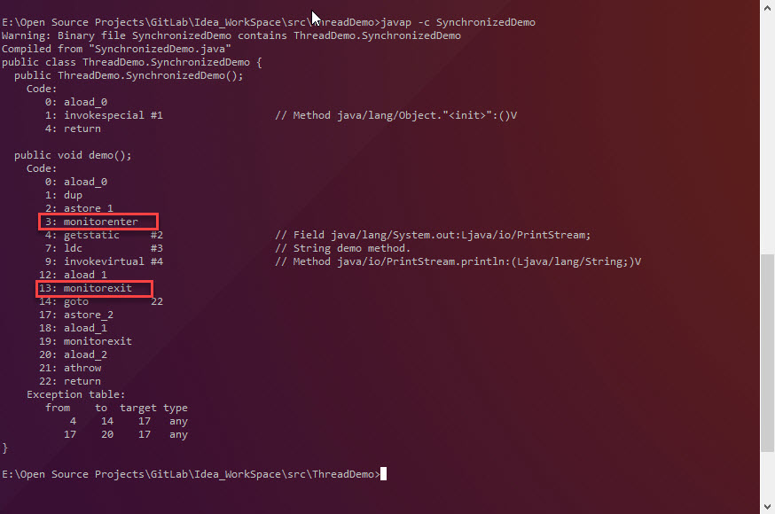
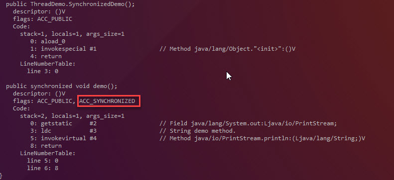
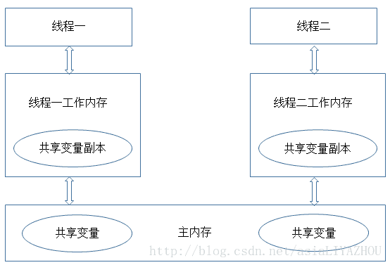

# Synchronized 及其实现原理

> 摘要:
>
> Synchronized是Java中实现进程同步最简单的一种方法,
>
>  Synchronized 主要有以下三个作用:
>
> 1. 保证互斥性
> 2. 保证可见性
> 3. 保证顺序性


Synchronized 有三种常用方法:

- 修饰普通方法
- 修饰静态方法
- 修饰代码块

##### Synchronized实现原理

先来看下这段代码:

```java
public class SynchronizedDemo {
    public void demo(){
        synchronized (this){
            System.out.println("demo method.");
        }
    }
}
```

这是一个典型的Synchronized修饰代码块的例子, Synchronized的对象是实例对象 意味着对一个SynchronizedDemo对象, 同一时间只能有一个线程可以执行demo() 方法.

检查一下上述代码对应的字节码:



> Command:
>
> javap -c SynchronizedDemo

可以看到synchronized所覆盖的代码块的收尾部分分别加上了monitorenter 和 monitorexit.

JVM对这两条指令的解释如下:

[monitorenter](http://docs.oracle.com/javase/specs/jvms/se7/html/jvms-6.html#jvms-6.5.monitorenter)

[monitorexit](http://docs.oracle.com/javase/specs/jvms/se7/html/jvms-6.html#jvms-6.5.monitorexit)

通过上述两段描述便不难理解`Synchronized`的实现原理了。`Synchronized`实际是通过关联一个对象的monitor来实现的。在前文的代码demo中，关联的对象实际就是`SynchonizedDemo`实例对象的monitor。其实wait/notify等方法也依赖于monitor对象，这就是为什么只有在同步的块或者方法中才能调用wait/notify等方法，否则会抛出java.lang.IllegalMonitorStateException的异常的原因。


用Synchronized修饰方法的场景:

```java
public class SynchronizedDemo {
    public synchronized void demo(){
        System.out.println("demo method.");
    }
}
```

对应的字节码:



> command:
>
> javap -c -v -l SynchronizedDemo

从反编译的结果看, 方法的同步并没有通过指令monitorenter和monitorexit来完成(理论上也可以通过这两条指令来实现). 不过相对于普通方法, 其常量池中多了ACC_SYNCHRONIZED标识符. JVM就是根据该标识符来实现方法同步的: 当方法调用时, 调用指令将会检查方法的ACC_SYNCHRONIZED标志是否被设置, 如果设置了, 执行线程将先获取一个monitor对象, 获取成功之后才能执行方法体, 方法执行完成后释放monitor. 在方法执行期间, 其他任何线程都无法再获得同一个monitor对象.其实本质上没有区别, 只是方法的同步是一种隐式的方式来实现, 无需通过字节码完成.

当Synchronized修饰不同的方法时, 获取的monitor对象不同:

- 修饰对象方法: 此时获取的monitor为实例对象(this)的monitor
- 修饰类方法时, 此时获取的monitor为类class对象(SynchronizedDemo.class)的monitor

通过上述解释，相信大家已经知道`Synchronized`是如何保证互斥性的，那么其是怎么实现可见性和顺序性的呢？其实也跟monitor相关：

- 可见性：执行到monitorenter时，线程会重新从主内存中将数据同步到本地工作内存，从而保证其可以看到其他线程的修改。同时执行monitorexit时，线程也会将本地工作内存的数据同步到主内存中

  

  在多线程环境下，每一个线程都维护一个本地的工作内存，线程操作一个共享变量时并不是直接操作在主内存中的变量，而是将其先拷贝到自己工作内存后再就行修改，同时在修改完成后再同步到主内存。而所谓可见性就是当某一个线程改变某一共享变量后，另一线程可以感知到这一变化。Java中通过`Synchronized`和`volatile`来保证可见性。

- 有序性：monitorenter、monitorexit修饰的代码将禁止进行重排序

  学过体系结构的朋友都知道，为了提高程序运行的效率，CPU会对指令进行重排序，以实现指令级并行。其实在现代操作系统中，除了指令级重排序外，编译器和内存系统也会进行相应的重排序以提升效率。

  在单线程环境下，以上的重排序是不会改变程序的运行逻辑的。但是到了多线程环境，这样的重排序则可能导致逻辑错乱。Java中通过`Synchronized`和`volatile`来保证顺序性。

