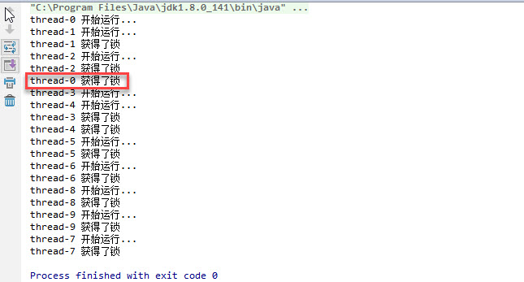

### 非公平锁

代码:

```java
public class FairAndUnfairLockDemo {

    static ReentrantLock reentrantLock = new ReentrantLock();

    public static void main(String[] args){

        for (int i = 0; i < 10; i++) {

            Thread thread = new Thread("thread-"+i){
                public void run(){
                    System.out.println(Thread.currentThread().getName()+" 开始运行...");
                    Test();
                };
            };

            thread.start();
        }
    }

    public static void Test(){
        reentrantLock.lock();

        System.out.println(Thread.currentThread().getName()+" 获得了锁");

        reentrantLock.unlock();
    }
}
```

结果:



线程-0是先运行的, 但是是后拿到锁的. 这就是非公平锁.